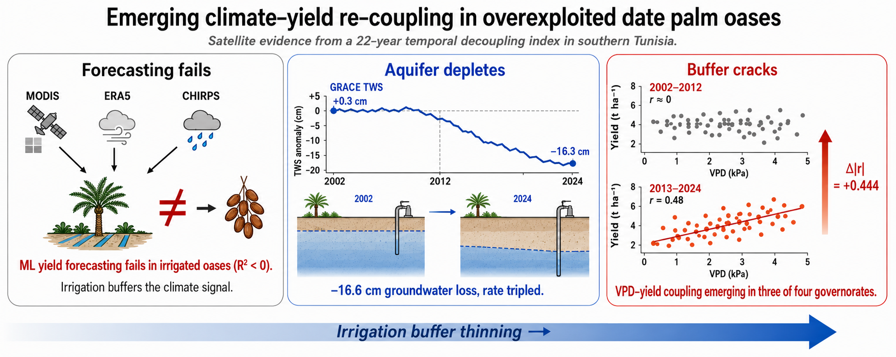
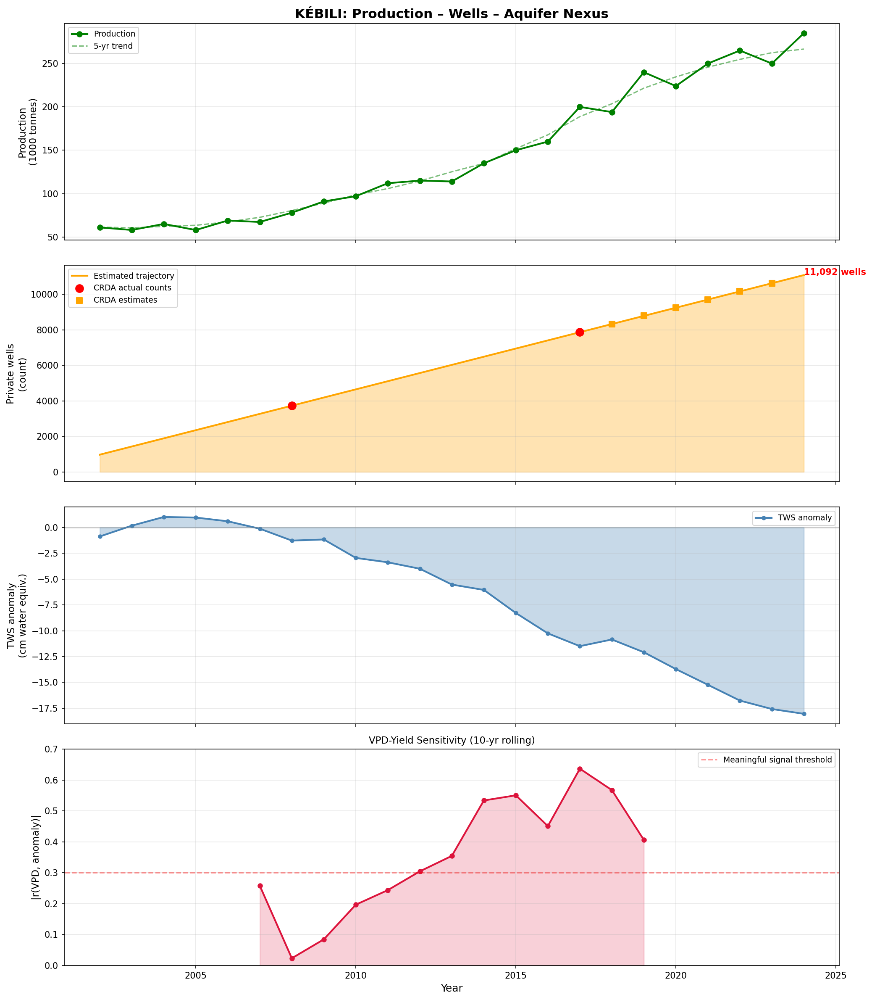
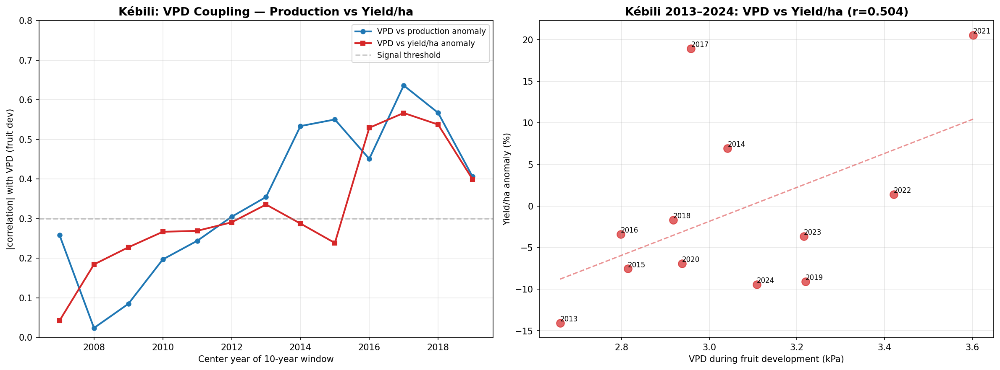

# DatePalm


*Conceptual overview of the three findings. Exact statistics in the associated paper.*

Satellite-based monitoring of aquifer sustainability and climate–yield
decoupling in southern Tunisia's date palm oases (2002–2024).

**Associated paper:** "Emerging climate–yield re-coupling in overexploited
date palm oases: satellite evidence from a 22-year temporal decoupling
index in southern Tunisia" — submitted to *Agricultural Water Management*.

**Authors:** Tarek Gasmi, Ramzi Gasmi, Slim Abdelbari, Soura Boulares, Sajeda Albarghati

---

## Key findings

### 1. Yield forecasting fails in irrigated oases

No ML model outperforms a naive trend baseline (~4.2% MAPE). All models
return negative R² on yield anomaly prediction. The irrigation buffer
decouples production from satellite-observable climate signals.

### 2. GRACE reveals −16.6 cm groundwater loss


*Kébili nexus: production growth, well proliferation, GRACE depletion, and emerging VPD sensitivity.*

Terrestrial water storage fell from +0.32 cm (2002–2005) to −16.26 cm
(2020–2024), with the depletion rate tripling from −0.44 cm yr⁻¹ to
−1.19 cm yr⁻¹ around 2012.

### 3. A temporal decoupling index detects emerging vulnerability


*VPD-yield/ha coupling: the signal survives area normalization.*

Under leakage-free linear detrending, three of four governorates show
statistically significant rising VPD–yield/ha coupling. Kébili's rolling
slope is +0.031 yr⁻¹ (HAC p = 3.7×10⁻⁶). The signal survives area
normalization (Δ|r| = +0.444) and is robust to break-year choice,
detrending method, and placebo-feature tests.

---

## Repository structure

```
DatePalm/
├── notebooks/          ← Colab analysis notebooks (complete pipeline)
│   ├── DatePalm_GEE_Data_Pipeline.ipynb
│   └── DatePalm_FeatureEng_Modeling.ipynb
├── data/
│   ├── raw_gee/        ← Individual satellite extraction CSVs
│   ├── onagri/          ← ONAGRI production + CRDA aquifer data
│   ├── compiled/        ← Master analysis tables
│   ├── area/            ← Stage 1 oasis area estimates (2002–2024)
│   └── grace_podaac/    ← Download instructions for GRACE NetCDF
├── results/
│   ├── figures/          ← All diagnostic and result figures
│   └── *.csv             ← Metrics, SHAP, rolling correlations
├── models/              ← Feature list (trained .pkl excluded — see README)
└── documentation/       ← Thesis outline, connex PFE specification
```

## Data sources

| Source | Product | Resolution | Period |
|--------|---------|-----------|--------|
| MODIS | MOD13A2 NDVI, MOD11A2 LST | 1 km | 2002–2024 |
| ERA5-Land | Monthly aggregates | 9 km | 2002–2024 |
| CHIRPS | Daily precipitation | 5 km | 2002–2024 |
| GRACE/GRACE-FO | JPL Mascon RL06.3M v04 | ~50 km | 2002–2024 |
| Sentinel-2 | L2A NDVI/NDWI | 10 m | 2015–2024 |
| ONAGRI/DGPA | Date production (tonnes) | Governorate | 2002–2024 |
| CRDA | Aquifer exploitation bulletins | Governorate | 2020–2024 |
| agridata.tn | Palm area, exports, arboriculture | National/Gov. | Various |

## Data access via TanitData

Ground-truth datasets from Tunisia's agricultural open data portal
([catalog.agridata.tn](https://catalog.agridata.tn)) were accessed
programmatically through the **TanitData MCP server**, a domain-adapted
AI data access layer that provides semantic vocabulary bridging for
Arabic/French agricultural datasets. The following datasets were retrieved
via TanitData:

- **ONAGRI production data:** "Évolution de la production des dattes" (DGPA)
- **CRDA aquifer bulletins:** Exploitation rates, well counts, salinity — for Tozeur, Kébili, Gafsa, Gabès
- **DGPA area data:** "Répartition de la superficie des plantations de palmier dattier en ha"
- **CRDA arboriculture:** Delegation-level palm area for Tozeur, Kébili, Gabès
- **INS export statistics:** Monthly export volumes and values
- **ONAGRI bibliography:** 25,000+ agricultural research records searched for literature review

If you use TanitData in your research, please cite:

```bibtex
@software{tanitdata2026,
  title     = {tanitdata: Domain-Adapted MCP Server for Tunisia's
               Agricultural Open Data},
  author    = {Gasmi, Tarek},
  year      = {2026},
  url       = {https://github.com/tanitdata/agridata-mcp},
  note      = {MCP server providing AI-mediated access to
               catalog.agridata.tn with semantic layer for
               vocabulary bridging}
}
```

## Study area

Four governorates of southern Tunisia: Tozeur, Kébili, Gafsa, Gabès.

| Governorate | Deep aquifer exploitation | 2024 production | Key feature |
|-------------|--------------------------|-----------------|-------------|
| Kébili | 229% | 285,000 t | Most overexploited; VPD re-coupling detected |
| Tozeur | 70% | 69,170 t | Hidden yield/ha re-coupling |
| Gafsa | 163% (shallow) | 12,500 t | Significant coupling trend |
| Gabès | 115% (shallow) | 22,000 t | Stable (negative control) |

## How to reproduce

1. Clone this repository
2. Download the GRACE NetCDF file (see `data/grace_podaac/README.md`)
3. Open `notebooks/DatePalm_GEE_Data_Pipeline.ipynb` in Google Colab
4. Authenticate with GEE (project: `bonplan-6c907`)
5. Run all cells — this extracts satellite data and compiles master datasets
6. Open `notebooks/DatePalm_FeatureEng_Modeling.ipynb` in Colab
7. Run all cells — this reproduces modeling, decoupling analysis, and the yield/ha critical test

## Requirements

- Google Colab (for GEE authentication and GPU)
- Python 3.10+
- Key packages: `earthengine-api`, `earthaccess`, `xarray`, `pandas`,
  `scikit-learn`, `xgboost`, `matplotlib`, `scipy`, `statsmodels`

## License

GPL-3.0. See [LICENSE](LICENSE).

## Citation

If you use this data or code, please cite both the paper and the data access tool:

```bibtex
@article{gasmi2026datepalm,
  title     = {Emerging climate--yield re-coupling in overexploited date
               palm oases: satellite evidence from a 22-year temporal
               decoupling index in southern Tunisia},
  author    = {Gasmi, Tarek and Gasmi, Ramzi and Abdelbari, Slim and
               Boulares, Soura and Albarghati, Sajeda},
  journal   = {Agricultural Water Management},
  year      = {2026},
  note      = {Submitted}
}

@software{tanitdata2026,
  title     = {tanitdata: Domain-Adapted MCP Server for Tunisia's
               Agricultural Open Data},
  author    = {Gasmi, Tarek},
  year      = {2026},
  url       = {https://github.com/tanitdata/agridata-mcp},
  note      = {MCP server providing AI-mediated access to
               catalog.agridata.tn with semantic layer for
               vocabulary bridging}
}
```
